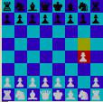

#Chess

This is a 2-player chess game, playable from the Terminal. To play, simply
download the file as .zip, then open up your terminal and run this line
from the game's directory:

`ruby game.rb`

To select your move, use the arrow keys. To select or unselect a piece/move, press Enter.

###Code Highlights
The pieces' behaviors have overlapping logic. So, I allow them to inherit
from 

For example, the king and the pawn
are both "stepping" pieces, in the sense that they can only move one square at a time.
(The pawn can move two on its first move, but that's just extra code in the pawn
class that overrides the module). Another example is the rook and queen, which
are both "sliding" pieces.
